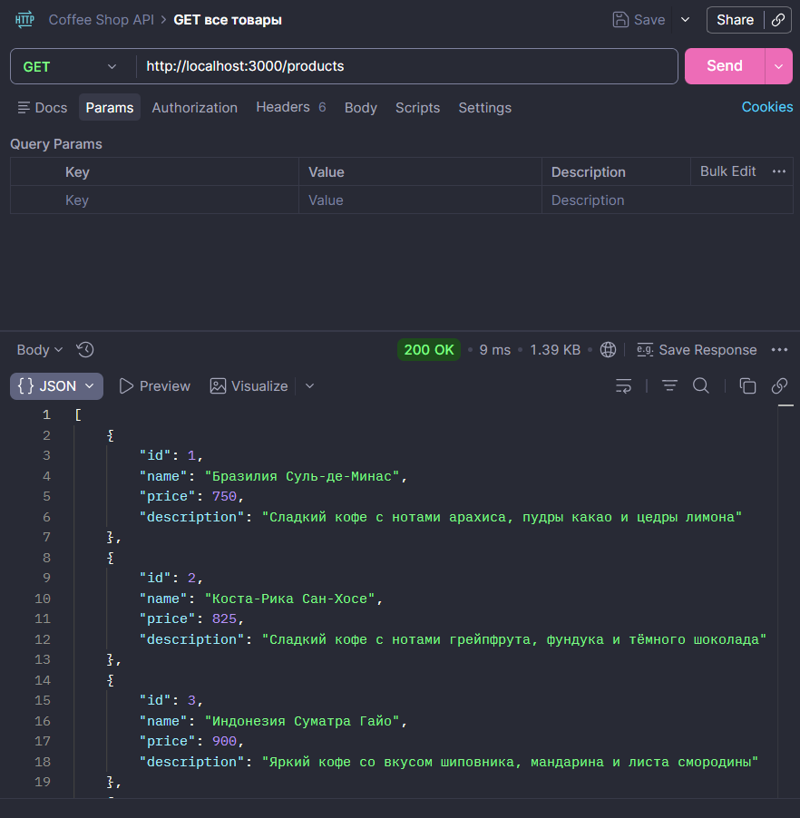
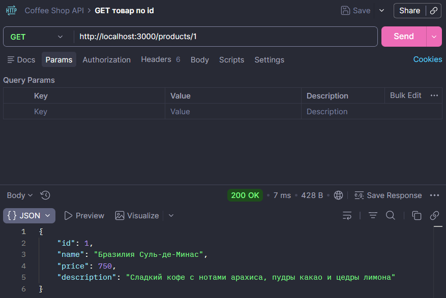
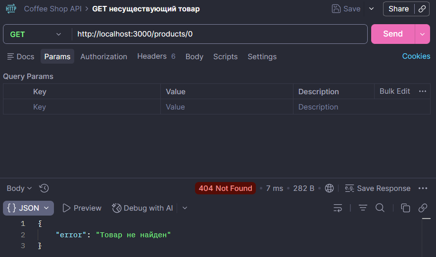
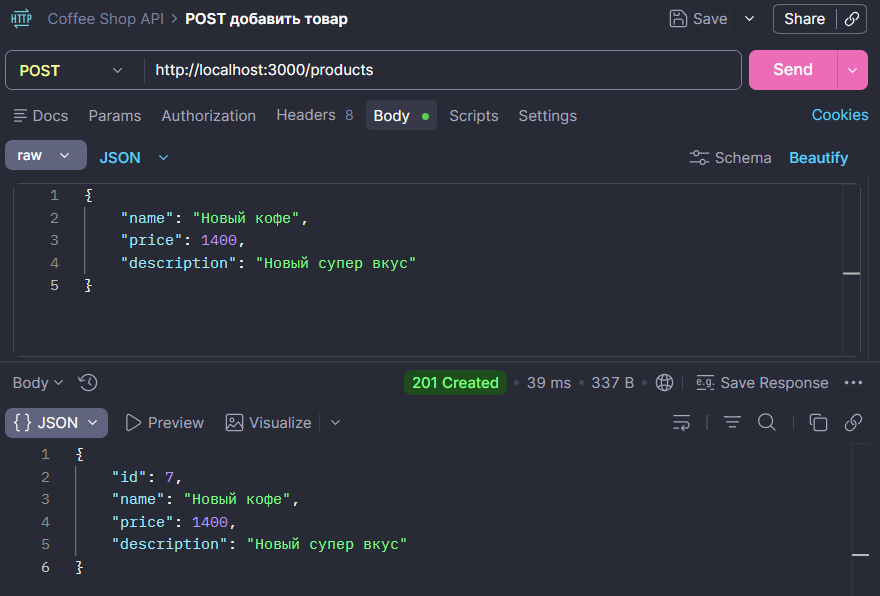
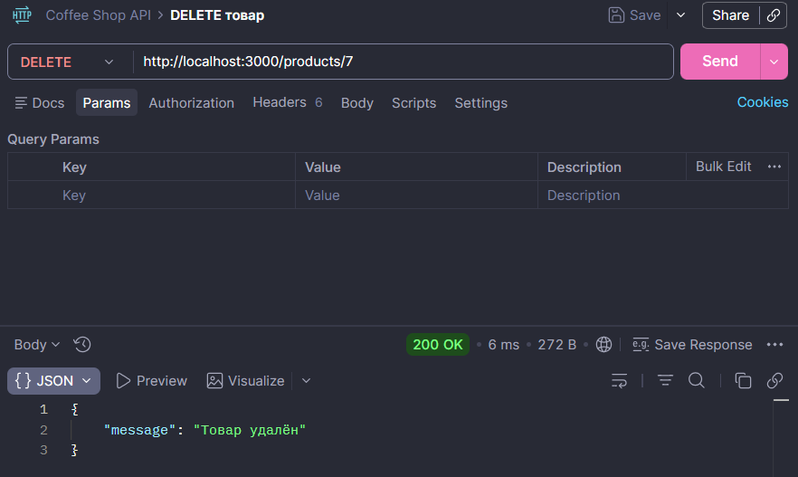

# Практическая работа №3

## Тестирование API кофейного магазина в Postman

### 1. GET /products — получение всех товаров

### 2. GET /products/1 — получение товара по ID

### 3. GET /products/0 — тест обработки ошибки

### 4. POST /products — добавление нового товара

### 5. DELETE /products/7 — удаление товара
